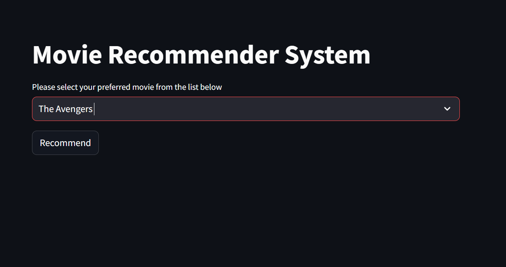
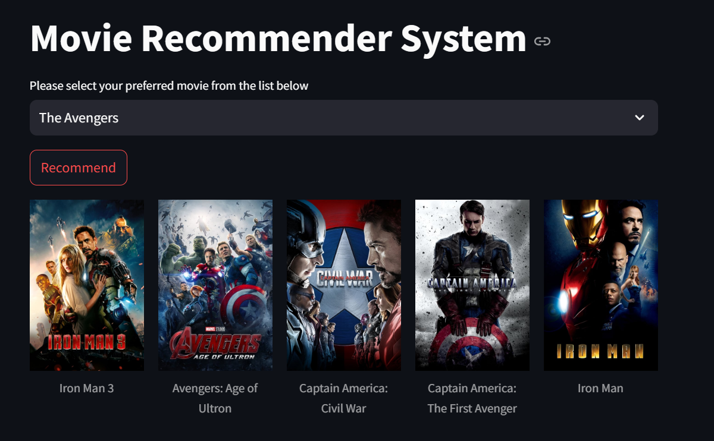

# Movie Recommendation System

This project is a **Movie Recommendation System** that suggests movies to users based on their preferences. It uses various machine learning techniques, including **vectorization**, **bag-of-words**, and **stemming**, to generate personalized recommendations. 

## Table of Contents
- [Project Overview](#project-overview)
- [Datasets](#datasets)
- [Key Concepts](#key-concepts)
- [Installation](#installation)
- [Usage](#usage)
- [Results](#results)
- [Deployed Application](#deployed-application)
- [Contributing](#contributing)
- [License](#license)

---

## Project Overview

The Movie Recommendation System aims to enhance the user experience by suggesting movies similar to their past preferences. The project uses both **collaborative filtering** and **content-based filtering** to build a hybrid recommendation system. 

The major steps include:
- **Data Preprocessing**: Cleaning and preparing the dataset for vectorization and feature extraction.
- **Model Training**: Building and training the model to generate recommendations.
- **Recommendations Generation**: Suggesting movies to the user based on preferences.

## Datasets

This project uses two datasets from **The Movie Database (TMDB)**, which are included in this repository:
1. **tmdb_5000_movies.csv**: Contains metadata for movies, including titles, genres, and descriptions.
2. **tmdb_5000_credits.csv**: Contains information about the cast and crew of each movie.

These datasets are pre-processed to extract relevant features for building the recommendation system.

## Key Concepts

This project employs several core data processing and machine learning concepts:

1. **Vectorization**: Converting textual data into numerical vectors that can be processed by machine learning algorithms.
2. **Bag-of-Words (BoW)**: Representing text as word frequency counts, ignoring word order but capturing frequency of each word in the text.
3. **Stemming**: Reducing words to their root forms, e.g., "running" to "run," to improve model accuracy.
4. **Cosine Similarity**: A metric used to determine similarity between movies based on their vector representations.

These techniques help the model understand user preferences and generate accurate movie recommendations.

## Installation

1. Clone this repository:
    ```bash
    git clone https://github.com/hahaanisha/Movie-Recommendation-System.git
    ```
2. Navigate to the project directory:
    ```bash
    cd movie-recommendation-system
    ```
3. Install the required packages:
    ```bash
    pip install -r requirements.txt
    ```

> **Note**: Make sure you have Python 3.7 or later installed.

## Usage

1. Ensure that `tmdb_5000_movies.csv` and `tmdb_5000_credits.csv` are in the root directory of this project.
2. Run the main script to train the model and generate recommendations:
    ```bash
    python movie_recommendation.py
    ```
3. Follow the on-screen instructions to get movie recommendations based on user input.

## Results

Below are some screenshots of the recommendation system in action:

### User Interface (movie list selection)


### Output:(Five recommended movies based on selected movie)


## Deployed Application

The Movie Recommendation System has been deployed online for easy access. You can test it out here:

**[Movie Recommendation System - Deployed Link](https://anisha-movie-recommendation.streamlit.app/)**

## Contributing

If you'd like to contribute:
1. Fork the repository
2. Create a new branch:
    ```bash
    git checkout -b feature-branch
    ```
3. Make your changes and commit:
    ```bash
    git commit -m "Your message"
    ```
4. Push to the branch:
    ```bash
    git push origin feature-branch
    ```
5. Open a pull request

## License

This project is licensed under the MIT License. See the [LICENSE](LICENSE) file for more details.

---

*Made with ❤️ by [Anisha Shankar](https://github.com/hahaanisha)*

